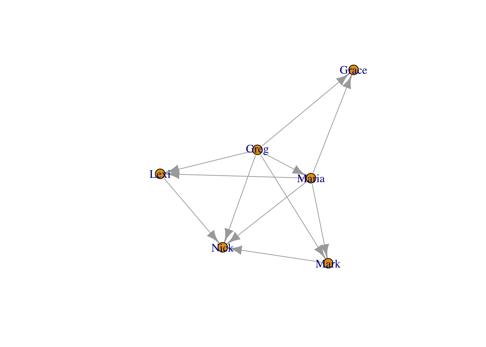
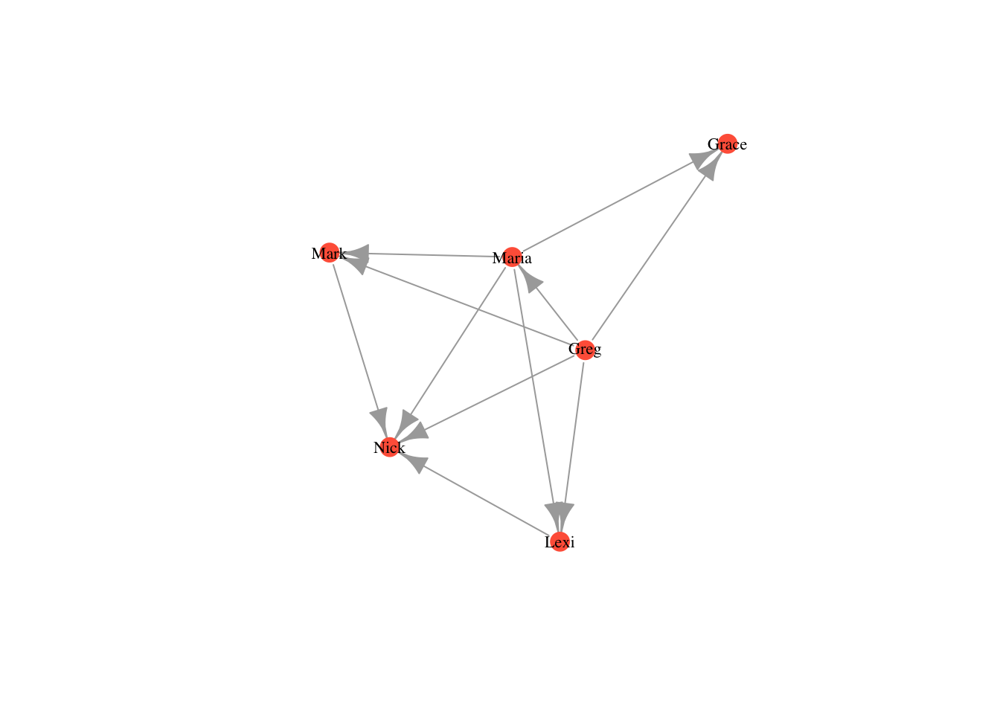
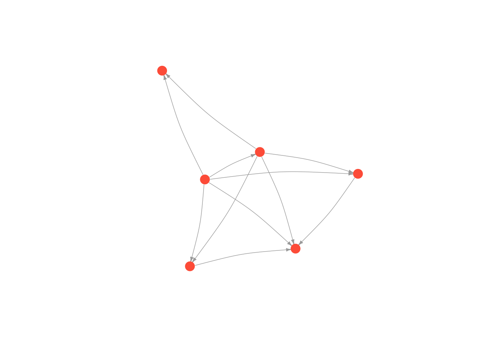

# 네트워크 시각화 (Network Visualization and Aesthetics)

이 장에서는 네트워크 시각화에 대해 배울 것이다. 구체적으로는 네트워크의 여러 구성 요소들을 변경함으로써 더 예쁜 네트워크를 그리는 방법을 연습할 것이다. 노드의 색상, 크기, 모양, 라벨을 변경하거나, 엣지의 색상, 너비, 휜 정도, 모양을 변경할 수 있다. 또한 네트워크 내의 다양한 집단의 위치를 표시할 수도 있다. 마지막으로 네트워크의 전반적인 레이아웃을 바꿀 수도 있다.  

## 기초 시각화 (The Basics)

1장에서 만든 `moneyNetwork`를 가지고 시각화 연습을 해보자. 바로 직전에 그렸던 디폴트 플랏은 아래와 같이 생겼었다. 

```{r , echo=FALSE, out.width = "80%", fig.align = "center"}
knitr::include_graphics("images/2.png")
```

이 그래프에서 가장 간단하게 바꿀 수 있는 것들은 노드의 크기와 색상이다. 특히 네트워크 규모가 큰 경우에, 노드들은 너무 크고 서로 뭉쳐져 보일 것이다. 이때 `vertex.size` 인자(argument)를 통해 노드의 크기를 조정해주면 된다. 

```{r, results='hide', eval=FALSE}

plot(moneyNetwork, vertex.size = 10)

```

```{r , echo=FALSE, out.width = "80%", fig.align = "center"}

```

이번에는 `vertex.color` 인자를 사용하여 노드 색상을 바꿔보자. `vertex.frame.color` 인자를 NA로 설정하여 노드의 검정 테두리를 없앨 수도 있다. 

```{r, results='hide', eval=FALSE}

plot(moneyNetwork, vertex.size = 10, vertex.color = "tomato", vertex.frame.color = NA)

```

```{r , echo=FALSE, out.width = "80%", fig.align = "center"}
knitr::include_graphics("images/4.png")

```

라벨이 너무 크고 파랗다. `vertex.label.cex` 인자를 통해 라벨 크기를 조절하고, `vertex.label.color`를 통해 라벨의 색상을 바꿔주자. 

```{r, results='hide', eval=FALSE}

plot(moneyNetwork, vertex.size = 10, vertex.color = "tomato", vertex.frame.color = NA, vertex.label.cex = .7, vertex.label.color = "black")
```

```{r echo=FALSE, out.width = "80%", fig.align = "center"}


```

만약 라벨을 아예 없애고 싶다면 `vertex.label` 인자의 값을 NA로 설정해주면 된다. 

```{r, results='hide', eval=FALSE}

plot(moneyNetwork, vertex.size = 10, vertex.color = "tomato", vertex.frame.color = NA, vertex.label = NA)

```

```{r echo=FALSE, out.width = "80%", fig.align = "center"}
knitr::include_graphics("images/6.png")

```

엣지의 경우에도 더 작고 더 휘게 만들어보자. 

```{r, results='hide', eval=FALSE}

plot(moneyNetwork, vertex.size = 10, vertex.color = "tomato", vertex.frame.color = NA, vertex.label.cex = .7,  vertex.label = NA, edge.curved = .1, edge.arrow.size = .3, edge.width = .7)

```

```{r echo=FALSE, out.width = "80%", fig.align = "center"}
knitr::include_graphics("images/7.png")

```


주의: `edge.curved`를 .1보다 더 크게 설정하면 오히려 더 이상해진다...따라서 적당한 값을 설정해야 한다. 

```{r, results='hide', eval=FALSE}

plot(moneyNetwork, vertex.size = 10, vertex.color = "tomato", vertex.frame.color = NA, vertex.label.cex = .7,  vertex.label = NA, edge.curved = 1.7, edge.arrow.size = .3, edge.width = .7)

```

```{r echo=FALSE, out.width = "80%", fig.align = "center"}
knitr::include_graphics("images/8.png")

```

## 네트워크 레이아웃 (Layouts)

네트워크 시각화의 중요한 요소는 레이아웃이다. 레이아웃에 따라 그래프 내에서 노드의 위치가 달라진다. 다양한 레이아웃 알고리즘이 존재하며, 이들의 공통점은 서로 교차하는 엣지의 개수를 최소화하는 것을 목표로 한다는 것이다. 가장 대표적인 알고리즘 두 가지를 소개하겠다: (1) Kamada Kawai, (2) Fruchterman Reingold 알고리즘.

레이아웃 알고리즘을 적용하기 위해서는 (1) 먼저 `layout.알고리즘명()` 함수 안에 네트워크를 넣어주어 레이아웃을 R 객체로 정의해야 한다. (2) 그 다음에는 `plot()` 안의 layout 인자 값으로 정의한 레이아웃을 입력하여 시각화를 해주면 된다. 연습해보자. 

***Kamada Kawai***
```{r, results='hide', eval=FALSE}

kamadaLayout <- layout.kamada.kawai(moneyNetwork)

plot(moneyNetwork, layout = kamadaLayout, vertex.size = 10, vertex.color = "tomato", vertex.frame.color = NA, vertex.label.cex = .7,  vertex.label = NA, edge.curved = .1, edge.arrow.size = .3, edge.width = .7)
```

```{r echo=FALSE, out.width = "80%", fig.align = "center"}
knitr::include_graphics("images/9.png")

```

***Frucherman-Reingold***
```{r, results='hide', eval=FALSE}

fruchtermanLayout <- layout.fruchterman.reingold(moneyNetwork)

plot(moneyNetwork, layout = fruchtermanLayout, vertex.size = 10, vertex.color = "tomato", vertex.frame.color = NA, vertex.label.cex = .7, vertex.label = NA, edge.curved = .1, edge.arrow.size = .3, edge.width = .7)
```

```{r , echo=FALSE, out.width = "80%", fig.align = "center"}


```


## 네트워크 객체에 특성 추가하기 (Adding attributes to a network object)

네트워크에서 특성/속성(attributes)들이 어떻게 분포해 있는지가 궁금할 수 있다. 예를 들어, 정치 커뮤니케이션 네트워크에서 노드들의 색상을 지지 정당에 따라 다르게 표시할 수 있겠다. 민주당 지지자는 파란색으로, 공화당 지지자는 빨간색으로 칠하여 네트워크에서 다르게 표현할 수 있는 것이다. 이러한 특성 분포를 표시하기 위해서는 별도의 데이터가 필요하다. 아래의 코드를 실행하여 각 행은 사람을, 각 열은 특성을 담고있는 attributes 데이터프레임을 만들어주자. 이 특성 데이터를 igraph에서 사용하기 위해서는 igraph 객체인 `moneyNetwork`의 노드들에 이 특성들을 할당해주어야 한다. 

```{r include=FALSE}
library(igraph)
library(tidyverse)
money_edgelist <- data.frame(
  Ego = c("Greg","Greg","Greg","Greg","Greg","Maria","Maria","Maria","Maria","Mark","Lexi"),
  Alter = c("Maria","Mark","Lexi","Grace","Nick","Mark","Lexi","Grace","Nick","Nick","Nick")
  )

money_edgelist = as.matrix(money_edgelist)

moneyNetwork <- graph.edgelist(money_edgelist, directed=TRUE)


```

```{r}

attributes <- data.frame(
  Name = c("Greg","Maria","Mark","Lexi","Grace","Nick"),
  Age = c(53,52,25,23,19,14),
  Gender = c("Male","Female","Male","Female","Female","Male"),
  Role = c("Father","Mother","Son","Daughter","Daughter","Son")
)
head(attributes)

```

다시 리마인드 하자면, `V()`함수를 통해 노드에 접근할 수 있고, `E()`함수를 통해 엣지에 접근 가능하다. 특성은 `$`를 이용하여 지정할 수 있다. 일단 `moneyNetwork` 기존 특성이었던 name을 변경해보자. 

```{r echo=TRUE, results='hide'}
# moneyNetwork 노드들의 이름 변경 
V(moneyNetwork)$name = c("Bob", "Linda", "Elias", "Catherine", "Eloise", "Pumpkin")

# 확인 
print(V(moneyNetwork)$name)
```

```{r, results='hide', eval=FALSE}

## [1] "Bob"       "Linda"     "Elias"     "Catherine" "Eloise"    "Pumpkin"

```

현재 우리의 네트워크에는 name 외의 다른 특성이 없는 상태이다. 따라서 네트워크 관계를 표현해주는 엣지리스트(행렬 형태) 뿐만 아니라 특성까지 한번에 포함시켜 네트워크 객체를 만들어야 한다. 이때 igraph 패키지의 `graph_from_data_frame()` 함수를 이용하면 된다. 

```{r, results='hide'}

# 엣지리스트와 특성을 둘 다 포함시키기 
moneyNetwork <- graph_from_data_frame(money_edgelist, directed = T, vertices = attributes)

```

확인해보자. 

```{r, results='hide'}

moneyNetwork

```

```{r, results='hide', eval=FALSE}

## IGRAPH 061b667 DN-- 6 11 -- 
## + attr: name (v/c), Age (v/n), Gender (v/c), Role (v/c)
## + edges from 061b667 (vertex names):
##  [1] Greg ->Maria Greg ->Mark  Greg ->Lexi  Greg ->Grace Greg ->Nick 
##  [6] Maria->Mark  Maria->Lexi  Maria->Grace Maria->Nick  Mark ->Nick 
## [11] Lexi ->Nick

```

이제 `V()$` 명령어를 통해 네트워크에서 각각의 특성을 구체적으로 확인해 볼 수 있다. 젠더를 확인해보자. 

```{r, results='hide'}

V(moneyNetwork)$Gender 

```


```{r, results='hide', eval=FALSE}

## [1] "Male"   "Female" "Male"   "Female" "Female" "Male"

```


## 특성에 따른 시각화 (Plotting based on attributes)

이번에는 젠더에 따라 색상을 달리 해보자. 이를 위해서는 젠더 특성에 따라 color를 다르게 지정해 주어야 한다. `ifelse()` 함수를 이용하여 네트워크의 색상을 지정해보자. 

```{r , echo=TRUE, results='hide'}

V(moneyNetwork)$color <- ifelse(V(moneyNetwork)$Gender == "Male", "dodgerblue3","seagreen")

```

자 이제 네트워크를 다시 그리면 젠더에 따라 노드 색상이 다르게 나타날 것이다. 이때 주의할 점은 `vertex.colors` 옵션을 설정하는 경우 override 된다는 것이다. 따라서 이 옵션은 반드시 제거해주자.   

```{r , echo=TRUE, results='hide'}

plot(moneyNetwork, vertex.size = 11)

```

다른 특성에 따라 노드 색상을 달리 해보자. 먼저 color를 리셋해야 한다. Role 특성 - Father, Mother, Son, Daughter - 에 따라서 색상을 달리 설정하는 코드는 아래와 같다. 

```{r echo=TRUE, results='hide'}

V(moneyNetwork)$color <- NA 
V(moneyNetwork)$color <- ifelse(V(moneyNetwork)$Role == "Father", "burlywood1","tomato")
V(moneyNetwork)$color <- ifelse(V(moneyNetwork)$Role == "Mother", "seagreen", V(moneyNetwork)$color)
V(moneyNetwork)$color <- ifelse(V(moneyNetwork)$Role == "Son", "grey70", V(moneyNetwork)$color)

plot(moneyNetwork, vertex.size = 12)

```

이번에는 나이에 따라 노드 크기를 달리 표시해보자. 노드 크기를 나이의 1/5에 비례하도록 세팅할 수 있다. 

```{r , echo=TRUE}

V(moneyNetwork)$size = V(moneyNetwork)$Age/5

plot(moneyNetwork, vertex.label.cex = .7,  edge.curved = .1, vertex.frame.color = NA, edge.arrow.size = .3, edge.width = .7, edge.color = "grey30")

```
