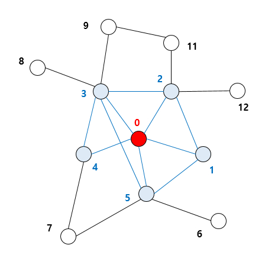

# 에고 네트워크(Ego Networks)
에고 네트워크는 에고(ego)라 불리는 하나의 중심이 되는 액터와 그 액터와 연결된 알터(alter)라 불리는 다른 액터들, 그리고 이들 알터들 간의 연결로 구성되는 네트워크를 말한다.
예를 들어 아래 네트워크 중 0의 에고 네트워크를 찾는다면, 에고인 0와 알터인 1, 2, 3, 4, 5을 포함하는 파란색으로 표시된 노드와 링크가 이에 해당한다.

```{r , echo=FALSE, out.width = "45%", fig.align = "center"}

```


## 에고 네트워크 분석하기 
2004년 GSS 서베이 데이터의 네트워크 모듈 데이터를 사용하여 에고 네트워크를 분석해보자. 
데이터는 호프만 교수의 깃헙에서 다운로드 받을 수 있다. 

```{r message=FALSE, warning=FALSE, results='hide'}

library(igraph)
gss <- read.csv("https://raw.githubusercontent.com/mahoffman/stanford_networks/main/data/gss_local_nets.csv", stringsAsFactors = TRUE) 

```

데이터가 어떻게 생겼는지 살펴보자. 

```{r}

head(gss)

```


변수는 총 42개이다. 처음 다섯 개 변수(sex, race, age, partyid, relig)는 각 응답자의 특성을 의미한다. 나머지는 네트워크를 구성하는 변수들이다. GSS 데이터 네트워크 모듈에서는 각 응답자에게 "중요한 이슈"에 대해 함께 논의한 최대 5명의 타인에 대해서 물어본다. numgiven 변수는 응답자가 중요한 이슈를 몇 명과 함께 논의했는지를 나타낸다. 또한 응답자들은 이 타인들 간의 관계에 대해 구체적으로 답한다. 예를 들어, 이들이 특별히 가까운지, 서로 아는지, 아예 모르는 사이인지 등에 대해 밝힌다. 따라서 close12 변수는 타인1과 타인2 간 가까운 정도를 의미한다. 마지막으로, 이 각각의 타인들의 특성(sex, race, age) 변수들도 수집되었다.   

왜 이 변수들이 에고 네트워크를 구성하는지 살펴보자. 먼저 각 응답자마다 close12부터 close45까지의 관계 변수들을 엣지 리스트로 바꾸어 주어야 한다. 

우선, grepl 함수를 사용하여 우리가 원하는 관계 변수들만을 추출하여 ties라는 데이터프레임으로 저장하자. 


```{r}

ties <- gss[,grepl("close", colnames(gss))]
head(ties)
```

각 응답자마다 다음의 작업을 진행할 것이다: 5 x 5 행렬을 만들어서 각 응답자마다 closeness 값을 채워 넣는다. 

```{r, results='hide'}

mat = matrix(nrow = 5, ncol = 5)

```

각 응답자의 close 값들을 행렬의 대각성분 아래쪽(lower triangle)에 할당할 수 있다. 
예를 들어 3번째 응답자의 close 값들을 넣어보자. 

```{r, results='hide'}

mat[lower.tri(mat)] <- as.numeric(ties[3,])

```

방향성이 없는 네트워크에서는 대각성분을 기준으로 대칭이기 때문에, 대각성분 위쪽(upper triangle)에도 값을 대칭적으로 넣어주면 된다. 

```{r, results='hide'}

mat[upper.tri(mat)] = t(mat)[upper.tri(mat)]
mat
```

```{r, results='hide', eval=FALSE}

##      [,1] [,2] [,3] [,4] [,5]
## [1,]   NA    1    2    0   NA
## [2,]    1   NA    2    2   NA
## [3,]    2    2   NA    1   NA
## [4,]    0    2    1   NA   NA
## [5,]   NA   NA   NA   NA   NA

```


이제 결측행(missing rows)을 지워주자. 
NA가 있는 행의 개수를 합한 값이 행렬의 행 개수보다 적은 경우, 결측행이 없다는 것을 의미한다. 
즉, 5 X 5 행렬에서 해당 응답자의 모든 응답이 NA인 경우, NA가 있는 행의 개수의 총합은 5이다. 
따라서 이 경우는 rowSums(is.na(mat))가 nrow(mat)와 같게 되는 결측행이다. 

```{r, results='hide'}

na_vals <- is.na(mat)
non_missing_rows <- rowSums(na_vals) < nrow(mat)
mat <- mat[non_missing_rows,non_missing_rows]
```

igraph 패키지는 NA를 처리하지 못하므로, 대각성분을 모두 0으로 바꿔주자. 

```{r, results='hide'}

diag(mat) <- 0
```

어떻게 생겼는지 확인해보자. 

```{r, results='hide', eval=FALSE}
mat
```

```{r, results='hide', eval=FALSE}
##      [,1] [,2] [,3] [,4]
## [1,]    0    1    2    0
## [2,]    1    0    2    2
## [3,]    2    2    0    1
## [4,]    0    2    1    0
```

자 이런 방식으로 인접행렬을 만들어서 3번째 응답자의 네트워크를 만들 수 있다. 

```{r, results='hide'}
ego_net <- graph.adjacency(mat, mode = "undirected", weighted = T)
```


```{r}
plot(ego_net, vertex.size = 30, vertex.label.color = "black", vertex.label.cex = 1)
```


문제는 3번째 응답자 뿐만 아니라 데이터의 모든 응답자에 대해서 위의 작업을 해야 한다는 것이다. 
따라서 위의 작업을 각 행마다 자동화해주는 함수를 만들어 사용하자. 

```{r, results='hide'}
make_ego_nets <- function(tie){
  # make the matrix
  mat = matrix(nrow = 5, ncol = 5)
  
  # assign the tie values to the lower triangle
  mat[lower.tri(mat)] <- as.numeric(tie)
  
  # symmetrize
  mat[upper.tri(mat)] = t(mat)[upper.tri(mat)]
  
  # identify missing values
  na_vals <- is.na(mat)
  
  # identify rows where all values are missing
  non_missing_rows <- rowSums(na_vals) < nrow(mat)
  
  # if any rows 
  if(sum(!non_missing_rows) > 0){
    mat <- mat[non_missing_rows,non_missing_rows]
  }
  diag(mat) <- 0
  ego_net <- graph.adjacency(mat, mode = "undirected", weighted = T)
  return(ego_net)
}
```

그 다음에는 lapply 함수[list+apply]를 사용해서 위에 정의한 함수를 데이터의 각 행에 적용해주면 된다. ties 데이터의 각 행은 각 응답자를 의미한다. 따라서 ties 데이터의 행 개수와 동일한 사이즈의 리스트가 결과로 출력될 것이고, 각 리스트 안에는 각 응답자의 에고 네트워크가 포함될 것이다. 

```{r}

ego_nets <- lapply(1:nrow(ties), 
                   FUN = function(x) make_ego_nets(ties[x,]))

head(ego_nets)

```

에고 네트워크의 리스트가 잘 만들어졌다. 그럼 랜덤으로 1021번째 응답자의 에고 네트워크를 추출해서 그려보자. 

```{r}
random_ego_net <- ego_nets[[1021]]
plot(random_ego_net)

```


## 네트워크 크기와 밀도 계산하기 (Calculating Network Size and Density)

네트워크의 리스트가 있으므로 lapply 함수를 써서 여러 가지를 계산할 수 있다. 
vcount() 함수로 네트워크 크기(=노드의 개수)를 계산하거나, ecount() 함수로 엣지의 개수를 계산할 수 있다. 

```{r}

network_sizes <- lapply(ego_nets, vcount)
network_edge_counts <- lapply(ego_nets, ecount)

head(network_sizes)

```
이 리스트를 벡터로 바꾼 후 mean() 안에 input으로 넣으면 평균도 계산 가능하다. 

```{r}

network_sizes <- unlist(network_sizes)
mean(network_sizes, na.rm = T)

```

평균 네트워크는 약 1.8 정도의 크기(=노드 개수)를 가지고 있다. 네트워크 크기의 분포를 시각화할 수도 있겠다. 
The average network has a little over one and a half people in it. We could similarly plot the distribution.

```{r}

hist(network_sizes, main = "Histogram of Ego Network Sizes", xlab = "Network Size")

```
 
엣지에 대해서도 똑같이 해볼 수 있다. 

```{r}

network_edge_counts <- unlist(network_edge_counts)
hist(network_edge_counts, main = "Histogram of Ego Network Edge Counts", xlab = "# of Edges")

```


다음은 밀도를 계산해보자. 네트워크 밀도는 한 네트워크의 링크 개수를 최대로 가능한 링크 개수의 총합으로 나눈 값이다. 예를 들어 방향성이 없는 네트워크에서는 노드가 총 N개 있다면(=size of N), 모두가 서로 연결됐다고 가정할 때 최대로 가능한 엣지 개수는 (N*(N-1))/2이다. 

밀도(Density)
- 실제로 존재하는 링크의 비율(가능성에 비해)
- 한 네트워크의 링크 개수를 최대로 가능한 링크 개수의 총합으로 나눈 값
- 평균 디그리/노드 숫자


앞서 랜덤으로 1021번째 응답자의 네트워크를 골랐던 것처럼, 이번에도 이 랜덤 네트워크의 밀도를 계산해보자. 

```{r}

ecount(random_ego_net)/((vcount(random_ego_net) * (vcount(random_ego_net) - 1))/2)

```


이렇게 계산해볼 수 있지만, 우리는 네트워크 리스트에 적용을 해야 한다. igraph 패키지의 graph.density 함수를 리스트의 각 요소에 적용한 후, 벡터로 만들어주자. 

```{r }

densities <- lapply(ego_nets, graph.density)
densities <- unlist(densities)

```

마지막으로 이 네트워크 밀도의 분포를 히스토그램으로 시각화할 수 있다. 

```{r}

hist(densities)

```
