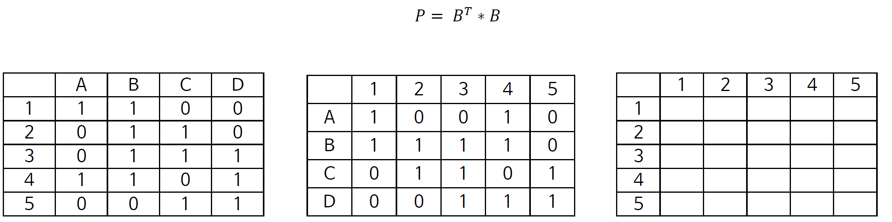

# 소속 관계 다루기(Affiliation Data)

이제까지 직접적인 one-mode 네트워크를 다뤘다. 이 장에서는 개인들이 affiliations를 통해 연결된 상황을 살펴본다. 예를 들어, 학생들은 서로 함께 수강한 수업들로 연결될 수 있다. 이러한 네트워크에서는 노드가 두 개의 타입으로 구분된다: 첫 번째 노드 타입은 학생들이고, 두 번째 노드 타입은 수업(classes)이 되겠다. 이 네트워크에서 학생들은 직접적으로 서로에게 연결되는 대신에, 수업 노드에 동시에 연결(co-affiliated)된다. 따라서 모든 연결고리(ties)는 다른 타입의 노드 간에 생성된다.  

* Two-mode Network(Bipartite Network)

  - 두 가지 종류의 노드가 있고, 한 종류의 노드는 다른 종류의 노드 사이에만 링크를 형성할 수 있는 네트워크
  
  - 소속을 표현할 때 많이 활용(사람-클럽/단어-문서)  
  
  - 이 네트워크를 표현하는 행렬은 incidence matrix(근접 행렬)라고 부름
  
  - B(i,j)가 1이면, j가 i가 속한다는 말/0이면 속하지 않음
  
  
```{r , echo=FALSE, out.width = "80%", fig.align = "center"}
knitr::include_graphics("images/twomode.png")
```
  
  
<br/>  
two-mode 네트워크를 만들기 위해서는 데이터를 엣지리스트로, 엣지리스트를 다시 행렬로 바꾼 후 igraph 패키지를 사용하여 시각화하면 된다. 실습 데이터는 아래와 같다. 

```{r, message=FALSE}

library(igraph)

classes_data <- data.frame(name = c("Leo", "Clement", "Palla", "Filippo"), 
                           class1 = c("Biostatistics","Islamic Civ", "Calc 1", "Linear Algebra"), 
                           class2 = c("Chemistry", "The Modern World-System", "Calc 2", "Social Networks"), 
                           class3 = c("Linear Algebra", "Exile and Diaspora", "Linear Algebra", "The Modern World-System"), 
                           stringsAsFactors = FALSE)

classes_data
```


이 데이터프레임을 엣지리스트로 바꾸기 위해서 `reshape2` 패키지를 설치하고 R에 불러와주자. `reshape2` 패키지의 `melt()` 함수는 소위 wide form의 데이터를 long form으로 바꿔준다. classes_data 형태가 현재에는 class1, class2, class3의 변수가 옆으로 나열된 wide form인데, 엣지리스트는 name과 class변수가 아래로 쭉 나열된 long form이다. 따라서 `melt()`함수를 통해 데이터프레임을 long form으로 변환해주고, 필요한 변수들만 취하면 된다. 


```{r, results='hide', message=FALSE, warning=FALSE}

# install.packages("reshape2")
library(reshape2)
classes_data <- melt(classes_data, measure.vars = c("class1", "class2","class3"), value.name = "classes", variable.name = "order")
classes_data
```

order 변수는 필요 없으니 name과 classes 변수만 선택해서 데이터를 갱신하면 다음과 같다. 

```{r}

classes_data <- subset(classes_data, select = c("name", "classes"))
classes_data
```

이제 데이터가 엣지리스트 형태로 되었다. 학생은 첫 번째 열에, 소속된 수업(affiliation)은 두 번째 열에 나열되어 있다. 소속 관계에 대한 엣지리스트가 완성되었다면, 그 다음은 igraph 객체, 즉 근접행렬로 만들어 주면 된다.  

```{r}

classesMatrix = table(classes_data)
class(classesMatrix) <- "matrix" # And we convert it from a table to a matrix

classesMatrix
```

`graph.incidence()` 함수를 사용하여 근접행렬을 bipartite 네트워크(=two-mode 네트워크)로 바꿔보자.


```{r, results='hide'}

classesNet <- graph.incidence(classesMatrix, mode = c("all"))
plot(classesNet, vertex.label.cex = .6, vertex.label.color = "black")
```
노드 타입에 따라 모양을 구분하여 시각화해보자. classesNet 네트워크 노드(vertex)의 특성(attribute) 변수로 shape 변수를 추가하자. 네트워크 노드의 타입은 `V()$type`으로 확인할 수 있다. 확인해보니 노드 타입이 학생인 경우 FALSE 값을, 수업인 경우 TRUE 값을 갖는다. `ifelse()`함수를 통해 노드 타입이 학생인 경우에는 동그라미 모양을, 수업인 경우 네모 모양을 갖는 shape 변수를 추가한 후에 다시 그려보자. 

```{r, results='hide'}

V(classesNet)$shape <- ifelse(V(classesNet)$type == FALSE, "circle", "square")
plot(classesNet, 
     vertex.label.cex = .6, 
     vertex.label.color = "black")
```


## 원모드 변환(Unipartite Projection)

투모드 네트워크(bipartitie network)는 원모드 네트워크(unipartite network)로 변환될(projected) 수 있다. 이 경우, 두 개의 노드 타입 중에서 하나만이 표시된다. 예를 들어, 동일한 수업을 함께 들었던 학생들끼리 연결되는 원모드 네트워크를 그리거나, 동일한 학생이 여러 개 수업을 들었을 때 이 소속 관계를 공유하는 수업들끼리 연결되는 원모드 네트워크를 그릴 수 있다. 

* One-mode projection: 이런 투모드 네트워크를 어느 한 종류의 노드 사이의 관계로 전환하는 것

  - 예를 들어 학생-수업 네트워크가 있다고 하면, 학생들의 네트워크/수업들의 네트워크 가능 
  
  - 같은 수업을 들었으면 학생 연결
  
  - 같은 학생이 수강하면 수업 연결
  
  - 근접행렬끼리 곱하는 식으로 도출 가능
  
```{r , echo=FALSE, out.width = "80%", fig.align = "center"}

```
  
<br/>
igraph 패키지의 `bipartite.projection()` 함수를 사용하거나, 근접행렬에다가 그것의 전치행렬(transpose)을 곱하여 변환 작업을 할 수 있다. 먼저 classesMatrix 근접접행렬에 전치행렬을 곱한 행렬을 만들어보자. 행렬 간 곱할 때에는 %*% 연산자를 사용한다. 

```{r}
personMatrix = classesMatrix %*% t(classesMatrix) 
personMatrix
```


이 행렬에서 대각성분은 각 학생이 소속된 집단(이 경우 수업)의 개수를 의미한다. 일단 이걸 따로 저장해주고, `diag()` 함수를 통해 이 행렬의 대각성분을 0으로 만들어주자. 


```{r}
number_of_classes_taken = diag(personMatrix)
diag(personMatrix) <- 0 
personMatrix

```

이 근접행렬은 학생들 간 같이 들은 수업이 있다면 1, 없다면 0의 값을 갖는다. 시각화해보자. 

```{r}

personNet <- graph.adjacency(personMatrix, mode = "undirected")

plot(personNet, vertex.size = 8, vertex.label.cex = .8, vertex.label.color = "black")

```

이번에는 그룹(수업) 간 연결이 된 원모드 네트워크를 그려보자. 방법은 간단하다. 근접행렬과 전치행렬끼리 곱해줄 때 그 순서를 바꿔서 곱하면 된다. 

```{r}
groupMatrix = t(classesMatrix) %*% classesMatrix
groupMatrix # The diagonal details the number of people in each class

```

마찬가지로 대각성분은 따로 저장해주고, 근접행렬의 대각성분을 0으로 바꿔준다. 

```{r}
number_of_students <- diag(groupMatrix)

diag(groupMatrix) <- 0 # we again set it to 0
```


이제 네트워크를 그려보자. 


```{r}

personNet <- graph.adjacency(personMatrix, mode = "undirected")
groupNet <- graph.adjacency(groupMatrix, mode = "undirected")

plot(personNet, vertex.label.cex = .6, vertex.label.color = "black")

```

```{r}

plot(groupNet, vertex.size = betweenness(groupNet)/max(betweenness(groupNet)) * 10, vertex.label.cex = .6, vertex.label.color = "black")
```


이렇게 투모드 네트워크를 원모드 네트워크로 변환한 후에 노드 타입이 하나일 때 했던 것처럼 다양한 네트워크 분석 기법을 적용할 수 있다. 


