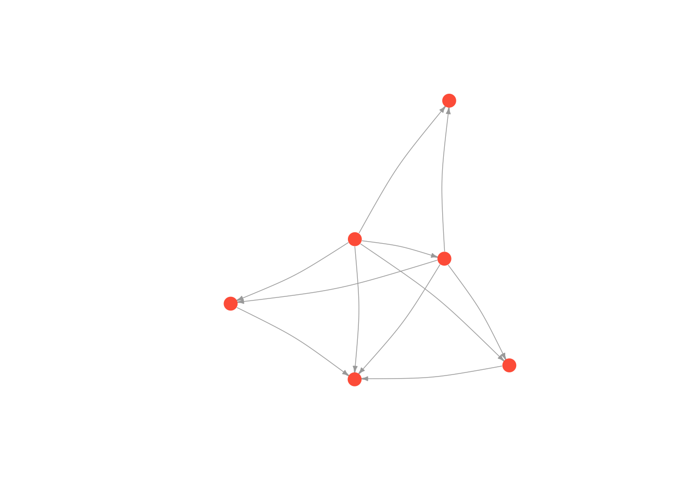
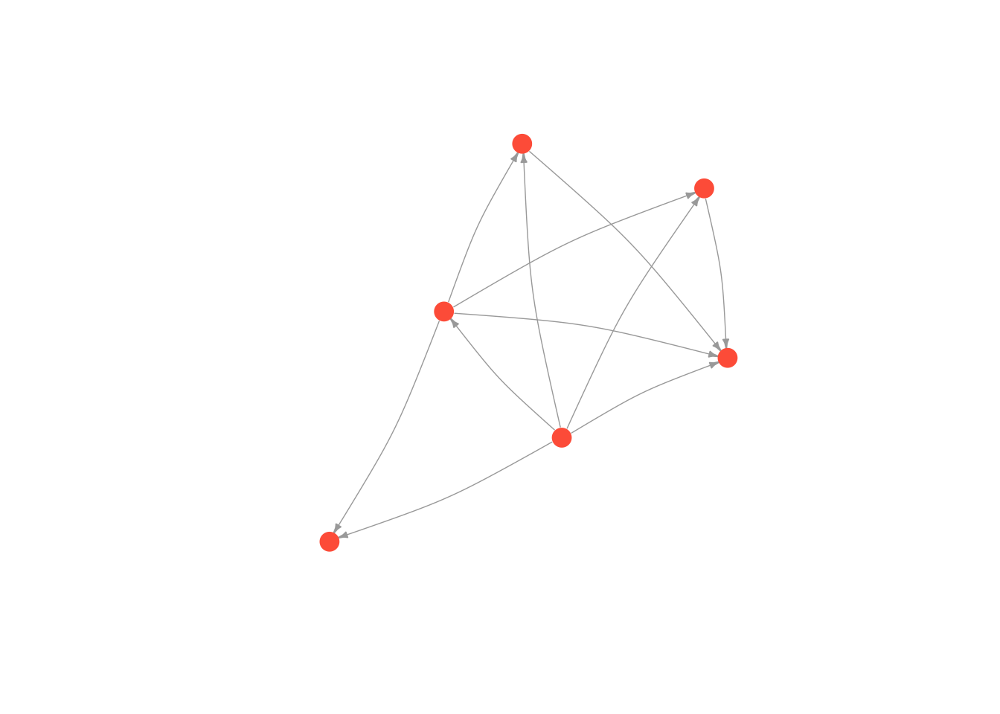

--- 
title: "Social Network Analysis in R"
author: "Do Won Kim, Hyowon Kim"
date: "`r Sys.Date()`"
site: bookdown::bookdown_site
output: bookdown::gitbook
documentclass: book
bibliography: [book.bib, packages.bib]
biblio-style: apalike
link-citations: yes
github-repo: rstudio/bookdown-demo
description: ""
---

# 들어가며 
이 튜토리얼은 서울대학교 정치커뮤니케이션센터 2023년 겨울방학 Social Network Analysis 워크샵을 위한 기초 수업 자료입니다. Mark Hoffman의 [Methods for Network Analysis](https://bookdown.org/markhoff/social_network_analysis/) 튜토리얼에 기반하여 제작되었습니다. 

This is the tutorial for **Social Network Analysis** Winter Methods Workshop (Center for Political Communication, Seoul National University). This tutorial is primarily based on the '[Methods for Network Analysis](https://bookdown.org/markhoff/social_network_analysis/)' by Mark Hoffman, with some modification. 


<!--chapter:end:index.Rmd-->


# 네트워크 데이터 구조 이해하기 (Understanding network data structures)

## 네트워크 데이터란? 
점과 선으로 이어진 구조

  * 점: node, vertex, point, actor
  * 선: link, edge, line, tie

<br/>
모든 네트워크는 '관계'에 관한 것이다. 네트워크는 여려 영향을 만들어 낸다. 

<br/>
네트워크 자료와 그에 대한 분석은 이제까지 개체의 속성에 주목한 데이터와 그에 대한 분석이 놓친 영역을 탐구할 수 있다.      

ex) 행복 결정 요인 연구

  * 기존: 소득, 교육 수준, 자기 효능감 등 개인에게 귀속되는 속성으로 분석  
  * 네트워크 분석: 행복이 네트워크를 따라 전파되며, 네트워크를 통해 연결된 타인의 행복이 나의 행복의 영향을 미침(ex. 친구의 친구가 행복하면, 나도 행복할 가능성이 커짐)   
  
<br/>
두 가지 네트워크 효과: 관계적 접근(relational approach) vs 위치적 접근(positional approach)  

  * 관계적 접근: 직접 연결이 미치는 영향에 주목
  * 위치적 접근: 네트워크 구조에서 지위가 만들어내는 역할 주목   
  
<br/>
네트워크 정보를 파악하는 관점 세 가지     

  * 전체 네트워크 수준: 밀도, 디그리 분포, 이행성, 글로벌 클러스터링 계수 등
  * 노드 수준: 중심성, 지위와 관련된 측정치들(isolate, bridge 등)
  * 링크 수준 혹은 두 개의 노드쌍 수준: 링크 가중치 등  
  
<br/>              
기본적으로 네트워크 분석에서 관계는 edge lists(엣지 리스트) 또는 adjacency matrices(인접행렬) 형태로 표현할 수 있다. 


## 엣지 리스트 (Edge lists) 
네트워크 표현법 1. 에지 리스트 - edges 를 나열하여 표현  

Edge lists는 컴퓨터에게 각 edge로 연결되어 있는 행위자들이 누군지를 알려준다. 
방향성이 있는 네트워크(directed graph)에서는 A 열의 행위자들이 연결을 주는 주체이며, B 열의 행위자들은 연결 받는 대상이다. 한편, 방향성이 없는 네트워크(undirected graph)에서 열의 순서는 상관 없다.   

R에서 edge lists를 만들어 보자. 먼저 열 벡터(column vectors)를 정의하고, 정의한 열 벡터들을 데이터 프레임의 변수로 만들어 주면 된다. 

```{r  echo=TRUE}

personA <- c("Mark", "Mark", "Peter", "Peter", "Bob", "Jill")
personB <- c("Peter", "Jill", "Bob", "Aaron", "Jill", "Aaron")

edgelist <- data.frame(PersonA = personA, PersonB = personB, stringsAsFactors = F)

print(edgelist)

```

Edge list는 네트워크를 표현하는 아주 간단한 방법이지만, 두 가지 단점이 있다.   
첫 번째, edge lists로는 어디에도 연결되지 않은 노드(고립노드/isolates)를 표현할 수 없다.   
두 번째, 수학적 계산에 용이한 데이터 형태가 아니다. 따라서 네트워크 분석을 위해서는 edge list를 인접행렬(adjacency matrix) 또는 네트워크 객체(network object)로 변환해야 한다. 


## 인접행렬(Adjacency matrices)

인접행렬의 각 행과 각 열은 노드(행위자)를 의미하며, 각 요소는 0 또는 1 이상의 정수 값을 갖는다. 예를 들어, 인접행렬의 1번째 행과 1번째 열에 해당하는 (1,1) 자리의 요소가 0이라면, 두 행위자가 네트워크에서 연결되지 않았음을 의미한다. 

먼저, 5 X 5 인접행렬을 만들어 보자. 이때 행(row)과 열(column) 차원의 이름(row names, column names)을 2차원 리스트로 지정해주자. 

```{r, echo=TRUE}

adjacency <- matrix(c(0,1,0,1,0,1,0,1,0,1,0,1,0,1,0,1,0,1,0,1,0,1,0,1,0), nrow = 5, ncol = 5, dimnames = list(c("Mark", "Peter", "Bob", "Jill", "Aaron"), c("Mark", "Peter", "Bob", "Jill", "Aaron")))

print(adjacency)

```

* 밀도(Density): 실제로 존재하는 링크의 비율(가능성에 비해)
  - 한 네트워크의 링크 개수를 최대로 가능한 링크 개수의 총합으로 나눈 값
  - 평균 디그리/노드 숫자  
<br/>
* 디그리(Degree): 어떤 노드가 다른 노드에 대해 가지는 링크의 숫자  
  - 방향이 있는 그래프에서는 in-degree와 out-degree가 나뉨  
  - 모든 노드의 디그리를 합치면, 링크 숫자의 두 배가 됨       
<br/>
* Weighted Networks(Valued Networks)
  - 링크가 있고 없고를 넘어서, 링크가 강도를 가질 수 있음  
  - 소셜 네트워크에서 행위자 간 접촉 빈도 등을 가중치로 설정할 수 있음
  - 앞서 존재한 인접행렬 매트릭스(Adjacency Matrix)로 표현 가능함. 입력 값이 0/1 두 개의 값이 아니라 다양한 값으로 표현됨(음수를 활용하는 경우도 있음)     
<br/>
* Directed Networks
  - 링크에 방향이 존재할 수 있음  
  - 앞선 네트워크들에서는 인접 매트릭스가 대칭 행렬이었음(방향이 없기 때문)
  - 방향을 가정할 때에는, A(i,j)와 A(j,i)가 다른 의미를 가짐. A(i,j)는 j로부터 i로 향하는 링크의 존재를 의미함(해석 주의!)
  - 약간 반직관적 설정이나, 여러 지표 계산에 최적화된 세팅임

## 데이터에서 네트워크로 (From data to networks)

R의 igraph 패키지는 네트워크를 시각화하는데 사용된다. 우선 igraph 패키지를 설치하고, igraph를 작업 공간에 불러오자. 

```{r , results='hide', warning=FALSE, message=FALSE}

# install.packages("igraph", repos='http://cran.us.r-project.org')
library(igraph)

```

먼저 실습에 필요한 edge list를 만들어 보자. 

채무 관계를 표현하는 edge list를 만들 것이다. Ego는 돈을 꿔준 사람, Alter는 돈을 받은 사람으로 하겠다. Ego 열 벡터와 Alter 열 벡터를 각각 만든 후, data.frame() 함수를 통해 데이터프레임 형태로 만든다. Ego와 Alter는 따라서 데이터프레임의 변수 명이 된다. 이렇게 만든 데이터프레임을 money_edgelist라는 이름으로 저장하자. 


```{r echo=TRUE}

money_edgelist <- data.frame(
  Ego = c("Greg","Greg","Greg","Greg","Greg","Maria","Maria","Maria","Maria","Mark","Lexi"),
  Alter = c("Maria","Mark","Lexi","Grace","Nick","Mark","Lexi","Grace","Nick","Nick","Nick")
  )

money_edgelist

```

이제 igraph 패키지를 사용하여 간단한 네트워크 분석을 해보자. igraph 패키지는 행렬만을 input으로 받는다. 따라서 데이터프레임을 행렬로 바꿔주어야 한다. 


```{r }

money_edgelist <- as.matrix(money_edgelist)

money_edgelist

```


igraph 패키지의 `graph.edgelist()` 함수를 통해 edge list를 네트워크 객체(network object)로 바꿀 수 있다. 이 함수에는 네트워크 데이터(=edge list)와 이 네트워크가 방향성이 있는지 없는지 여부가 인자(argument)로 들어간다. 우리의 채무 네트워크의 경우 Ego에서 Alter로의 방향성이 있다. 

```{r}
  
  moneyNetwork <- graph.edgelist(money_edgelist, directed=TRUE)

```

igraph 패키지를 통해 modey_edgelist 데이터를 moneyNetwork라는 네트워크 객체로 바꿔주었다. 

그렇다면 인접행렬의 경우는 어떻게 네트워크 객체로 바꿀 수 있을까? 인접행렬은 igraph 패키지의 `graph.adjacency()` 함수를 통해 네트워크로 바꿔주면 된다. 

```{r}
  # 참고 
  graph.adjacency(adjacency, mode = "undirected")

```

## 네트워크 탐색하기 (Exploring the network)
이제 네트워크의 각각의 요소들이 무엇을 의미하는지 알아보자. 
아까 만든 moneyNetwork를 입력하면 네트워크의 summary가 출력된다. 

```{r}

  moneyNetwork

```
IGRAPH DN 으로 시작하는 맨 첫 줄은 moneyNetwork가 igraph object이고, 방향성이 있는 네트워크 (directed network)이며, 6개의 노드와 11개의 에지로 구성되었음을 알려준다. 

두 번째 줄은 moneyNetwork가 노드(vertices, v/c)의 이름(name)을 특성(attribute)으로 가지고 있음을 알려준다. 따라서 우리는 네트워크의 name 특성을 따로 뽑아낼 수 있다. 네트워크의 특성을 뽑아낼 때에는 `V()$` 를 사용한다. 

```{r }

V(moneyNetwork)$name

```
summary의 첫 번째 줄에서 봤듯이, 이 네트워크의 노드는 총 6개가 있었고, 각 노드의 이름이 특성으로 저장되어 있다. 

다음으로, 세 번째 줄은 네트워크의 edges의 snapshot을 보여준다. 

plot() 함수를 사용하면 전체 네트워크를 시각화할 수 있다. 
```{r, results='hide', eval=FALSE}

plot(moneyNetwork)

```

```{r echo=FALSE, out.width = "80%", fig.align = "center"}
knitr::include_graphics("images/1.png")
```

디폴트 그래프는 못 생겼다...다음 장에서 네트워크 시각화에 대해 더 배워보자. 


<!--chapter:end:01.Rmd-->

# 네트워크 시각화 (Network Visualization and Aesthetics)

이 장에서는 네트워크 시각화에 대해 배울 것이다. 구체적으로는 네트워크의 여러 구성 요소들을 변경함으로써 더 예쁜 네트워크를 그리는 방법을 연습할 것이다. 노드의 색상, 크기, 모양, 라벨을 변경하거나, 엣지의 색상, 너비, 휜 정도, 모양을 변경할 수 있다. 또한 네트워크 내의 다양한 집단의 위치를 표시할 수도 있다. 마지막으로 네트워크의 전반적인 레이아웃을 바꿀 수도 있다.  

## 기초 시각화 (The Basics)

1장에서 만든 `moneyNetwork`를 가지고 시각화 연습을 해보자. 바로 직전에 그렸던 디폴트 플랏은 아래와 같이 생겼었다. 

```{r , echo=FALSE, out.width = "80%", fig.align = "center"}
knitr::include_graphics("images/2.png")
```

이 그래프에서 가장 간단하게 바꿀 수 있는 것들은 노드의 크기와 색상이다. 특히 네트워크 규모가 큰 경우에, 노드들은 너무 크고 서로 뭉쳐져 보일 것이다. 이때 `vertex.size` 인자(argument)를 통해 노드의 크기를 조정해주면 된다. 

```{r, results='hide', eval=FALSE}

plot(moneyNetwork, vertex.size = 10)

```

```{r , echo=FALSE, out.width = "80%", fig.align = "center"}
knitr::include_graphics("images/3.png")
```

이번에는 `vertex.color` 인자를 사용하여 노드 색상을 바꿔보자. `vertex.frame.color` 인자를 NA로 설정하여 노드의 검정 테두리를 없앨 수도 있다. 

```{r, results='hide', eval=FALSE}

plot(moneyNetwork, vertex.size = 10, vertex.color = "tomato", vertex.frame.color = NA)

```

```{r , echo=FALSE, out.width = "80%", fig.align = "center"}
knitr::include_graphics("images/4.png")

```

라벨이 너무 크고 파랗다. `vertex.label.cex` 인자를 통해 라벨 크기를 조절하고, `vertex.label.color`를 통해 라벨의 색상을 바꿔주자. 

```{r, results='hide', eval=FALSE}

plot(moneyNetwork, vertex.size = 10, vertex.color = "tomato", vertex.frame.color = NA, vertex.label.cex = .7, vertex.label.color = "black")
```

```{r echo=FALSE, out.width = "80%", fig.align = "center"}
knitr::include_graphics("images/5.png")

```

만약 라벨을 아예 없애고 싶다면 `vertex.label` 인자의 값을 NA로 설정해주면 된다. 

```{r, results='hide', eval=FALSE}

plot(moneyNetwork, vertex.size = 10, vertex.color = "tomato", vertex.frame.color = NA, vertex.label = NA)

```

```{r echo=FALSE, out.width = "80%", fig.align = "center"}
knitr::include_graphics("images/6.png")

```

엣지의 경우에도 더 작고 더 휘게 만들어보자. 

```{r, results='hide', eval=FALSE}

plot(moneyNetwork, vertex.size = 10, vertex.color = "tomato", vertex.frame.color = NA, vertex.label.cex = .7,  vertex.label = NA, edge.curved = .1, edge.arrow.size = .3, edge.width = .7)

```

```{r echo=FALSE, out.width = "80%", fig.align = "center"}


```


주의: `edge.curved`를 .1보다 더 크게 설정하면 오히려 더 이상해진다...따라서 적당한 값을 설정해야 한다. 

```{r, results='hide', eval=FALSE}

plot(moneyNetwork, vertex.size = 10, vertex.color = "tomato", vertex.frame.color = NA, vertex.label.cex = .7,  vertex.label = NA, edge.curved = 1.7, edge.arrow.size = .3, edge.width = .7)

```

```{r echo=FALSE, out.width = "80%", fig.align = "center"}
knitr::include_graphics("images/8.png")

```

## 네트워크 레이아웃 (Layouts)

네트워크 시각화의 중요한 요소는 레이아웃이다. 레이아웃에 따라 그래프 내에서 노드의 위치가 달라진다. 다양한 레이아웃 알고리즘이 존재하며, 이들의 공통점은 서로 교차하는 엣지의 개수를 최소화하는 것을 목표로 한다는 것이다. 가장 대표적인 알고리즘 두 가지를 소개하겠다: (1) Kamada Kawai, (2) Fruchterman Reingold 알고리즘.

레이아웃 알고리즘을 적용하기 위해서는 (1) 먼저 `layout.알고리즘명()` 함수 안에 네트워크를 넣어주어 레이아웃을 R 객체로 정의해야 한다. (2) 그 다음에는 `plot()` 안의 layout 인자 값으로 정의한 레이아웃을 입력하여 시각화를 해주면 된다. 연습해보자. 

***Kamada Kawai***
```{r, results='hide', eval=FALSE}

kamadaLayout <- layout.kamada.kawai(moneyNetwork)

plot(moneyNetwork, layout = kamadaLayout, vertex.size = 10, vertex.color = "tomato", vertex.frame.color = NA, vertex.label.cex = .7,  vertex.label = NA, edge.curved = .1, edge.arrow.size = .3, edge.width = .7)
```

```{r echo=FALSE, out.width = "80%", fig.align = "center"}


```

***Frucherman-Reingold***
```{r, results='hide', eval=FALSE}

fruchtermanLayout <- layout.fruchterman.reingold(moneyNetwork)

plot(moneyNetwork, layout = fruchtermanLayout, vertex.size = 10, vertex.color = "tomato", vertex.frame.color = NA, vertex.label.cex = .7, vertex.label = NA, edge.curved = .1, edge.arrow.size = .3, edge.width = .7)
```

```{r , echo=FALSE, out.width = "80%", fig.align = "center"}
knitr::include_graphics("images/10.png")

```


## 네트워크 객체에 특성 추가하기 (Adding attributes to a network object)

네트워크에서 특성/속성(attributes)들이 어떻게 분포해 있는지가 궁금할 수 있다. 예를 들어, 정치 커뮤니케이션 네트워크에서 노드들의 색상을 지지 정당에 따라 다르게 표시할 수 있겠다. 민주당 지지자는 파란색으로, 공화당 지지자는 빨간색으로 칠하여 네트워크에서 다르게 표현할 수 있는 것이다. 이러한 특성 분포를 표시하기 위해서는 별도의 데이터가 필요하다. 아래의 코드를 실행하여 각 행은 사람을, 각 열은 특성을 담고있는 attributes 데이터프레임을 만들어주자. 이 특성 데이터를 igraph에서 사용하기 위해서는 igraph 객체인 `moneyNetwork`의 노드들에 이 특성들을 할당해주어야 한다. 

```{r include=FALSE}
library(igraph)
library(tidyverse)
money_edgelist <- data.frame(
  Ego = c("Greg","Greg","Greg","Greg","Greg","Maria","Maria","Maria","Maria","Mark","Lexi"),
  Alter = c("Maria","Mark","Lexi","Grace","Nick","Mark","Lexi","Grace","Nick","Nick","Nick")
  )

money_edgelist = as.matrix(money_edgelist)

moneyNetwork <- graph.edgelist(money_edgelist, directed=TRUE)


```

```{r}

attributes <- data.frame(
  Name = c("Greg","Maria","Mark","Lexi","Grace","Nick"),
  Age = c(53,52,25,23,19,14),
  Gender = c("Male","Female","Male","Female","Female","Male"),
  Role = c("Father","Mother","Son","Daughter","Daughter","Son")
)
head(attributes)

```

다시 리마인드 하자면, `V()`함수를 통해 노드에 접근할 수 있고, `E()`함수를 통해 엣지에 접근 가능하다. 특성은 `$`를 이용하여 지정할 수 있다. 일단 `moneyNetwork` 기존 특성이었던 name을 변경해보자. 

```{r echo=TRUE, results='hide'}
# moneyNetwork 노드들의 이름 변경 
V(moneyNetwork)$name = c("Bob", "Linda", "Elias", "Catherine", "Eloise", "Pumpkin")

# 확인 
print(V(moneyNetwork)$name)
```

```{r, results='hide', eval=FALSE}

## [1] "Bob"       "Linda"     "Elias"     "Catherine" "Eloise"    "Pumpkin"

```

현재 우리의 네트워크에는 name 외의 다른 특성이 없는 상태이다. 따라서 네트워크 관계를 표현해주는 엣지리스트(행렬 형태) 뿐만 아니라 특성까지 한번에 포함시켜 네트워크 객체를 만들어야 한다. 이때 igraph 패키지의 `graph_from_data_frame()` 함수를 이용하면 된다. 

```{r, results='hide'}

# 엣지리스트와 특성을 둘 다 포함시키기 
moneyNetwork <- graph_from_data_frame(money_edgelist, directed = T, vertices = attributes)

```

확인해보자. 

```{r, results='hide'}

moneyNetwork

```

```{r, results='hide', eval=FALSE}

## IGRAPH 061b667 DN-- 6 11 -- 
## + attr: name (v/c), Age (v/n), Gender (v/c), Role (v/c)
## + edges from 061b667 (vertex names):
##  [1] Greg ->Maria Greg ->Mark  Greg ->Lexi  Greg ->Grace Greg ->Nick 
##  [6] Maria->Mark  Maria->Lexi  Maria->Grace Maria->Nick  Mark ->Nick 
## [11] Lexi ->Nick

```

이제 `V()$` 명령어를 통해 네트워크에서 각각의 특성을 구체적으로 확인해 볼 수 있다. 젠더를 확인해보자. 

```{r, results='hide'}

V(moneyNetwork)$Gender 

```


```{r, results='hide', eval=FALSE}

## [1] "Male"   "Female" "Male"   "Female" "Female" "Male"

```


## 특성에 따른 시각화 (Plotting based on attributes)

이번에는 젠더에 따라 색상을 달리 해보자. 이를 위해서는 젠더 특성에 따라 color를 다르게 지정해 주어야 한다. `ifelse()` 함수를 이용하여 네트워크의 색상을 지정해보자. 

```{r , echo=TRUE, results='hide'}

V(moneyNetwork)$color <- ifelse(V(moneyNetwork)$Gender == "Male", "dodgerblue3","seagreen")

```

자 이제 네트워크를 다시 그리면 젠더에 따라 노드 색상이 다르게 나타날 것이다. 이때 주의할 점은 `vertex.colors` 옵션을 설정하는 경우 override 된다는 것이다. 따라서 이 옵션은 반드시 제거해주자.   

```{r , echo=TRUE, results='hide'}

plot(moneyNetwork, vertex.size = 11)

```

다른 특성에 따라 노드 색상을 달리 해보자. 먼저 color를 리셋해야 한다. Role 특성 - Father, Mother, Son, Daughter - 에 따라서 색상을 달리 설정하는 코드는 아래와 같다. 

```{r echo=TRUE, results='hide'}

V(moneyNetwork)$color <- NA 
V(moneyNetwork)$color <- ifelse(V(moneyNetwork)$Role == "Father", "burlywood1","tomato")
V(moneyNetwork)$color <- ifelse(V(moneyNetwork)$Role == "Mother", "seagreen", V(moneyNetwork)$color)
V(moneyNetwork)$color <- ifelse(V(moneyNetwork)$Role == "Son", "grey70", V(moneyNetwork)$color)

plot(moneyNetwork, vertex.size = 12)

```

이번에는 나이에 따라 노드 크기를 달리 표시해보자. 노드 크기를 나이의 1/5에 비례하도록 세팅할 수 있다. 

```{r , echo=TRUE}

V(moneyNetwork)$size = V(moneyNetwork)$Age/5

plot(moneyNetwork, vertex.label.cex = .7,  edge.curved = .1, vertex.frame.color = NA, edge.arrow.size = .3, edge.width = .7, edge.color = "grey30")

```

<!--chapter:end:02.Rmd-->

# 에고 네트워크(Ego Networks)
에고 네트워크는 에고(ego)라 불리는 하나의 중심이 되는 액터와 그 액터와 연결된 알터(alter)라 불리는 다른 액터들, 그리고 이들 알터들 간의 연결로 구성되는 네트워크를 말한다.
예를 들어 아래 네트워크 중 0의 에고 네트워크를 찾는다면, 에고인 0와 알터인 1, 2, 3, 4, 5을 포함하는 파란색으로 표시된 노드와 링크가 이에 해당한다.

```{r , echo=FALSE, out.width = "45%", fig.align = "center"}
knitr::include_graphics("images/ego.png")
```


## 에고 네트워크 분석하기 
2004년 GSS 서베이 데이터의 네트워크 모듈 데이터를 사용하여 에고 네트워크를 분석해보자. 
데이터는 호프만 교수의 깃헙에서 다운로드 받을 수 있다. 

```{r message=FALSE, warning=FALSE, results='hide'}

library(igraph)
gss <- read.csv("https://raw.githubusercontent.com/mahoffman/stanford_networks/main/data/gss_local_nets.csv", stringsAsFactors = TRUE) 

```

데이터가 어떻게 생겼는지 살펴보자. 

```{r}

head(gss)

```


변수는 총 42개이다. 처음 다섯 개 변수(sex, race, age, partyid, relig)는 각 응답자의 특성을 의미한다. 나머지는 네트워크를 구성하는 변수들이다. GSS 데이터 네트워크 모듈에서는 각 응답자에게 "중요한 이슈"에 대해 함께 논의한 최대 5명의 타인에 대해서 물어본다. numgiven 변수는 응답자가 중요한 이슈를 몇 명과 함께 논의했는지를 나타낸다. 또한 응답자들은 이 타인들 간의 관계에 대해 구체적으로 답한다. 예를 들어, 이들이 특별히 가까운지, 서로 아는지, 아예 모르는 사이인지 등에 대해 밝힌다. 따라서 close12 변수는 타인1과 타인2 간 가까운 정도를 의미한다. 마지막으로, 이 각각의 타인들의 특성(sex, race, age) 변수들도 수집되었다.   

왜 이 변수들이 에고 네트워크를 구성하는지 살펴보자. 먼저 각 응답자마다 close12부터 close45까지의 관계 변수들을 엣지 리스트로 바꾸어 주어야 한다. 

우선, grepl 함수를 사용하여 우리가 원하는 관계 변수들만을 추출하여 ties라는 데이터프레임으로 저장하자. 


```{r}

ties <- gss[,grepl("close", colnames(gss))]
head(ties)
```

각 응답자마다 다음의 작업을 진행할 것이다: 5 x 5 행렬을 만들어서 각 응답자마다 closeness 값을 채워 넣는다. 

```{r, results='hide'}

mat = matrix(nrow = 5, ncol = 5)

```

각 응답자의 close 값들을 행렬의 대각성분 아래쪽(lower triangle)에 할당할 수 있다. 
예를 들어 3번째 응답자의 close 값들을 넣어보자. 

```{r, results='hide'}

mat[lower.tri(mat)] <- as.numeric(ties[3,])

```

방향성이 없는 네트워크에서는 대각성분을 기준으로 대칭이기 때문에, 대각성분 위쪽(upper triangle)에도 값을 대칭적으로 넣어주면 된다. 

```{r, results='hide'}

mat[upper.tri(mat)] = t(mat)[upper.tri(mat)]
mat
```

```{r, results='hide', eval=FALSE}

##      [,1] [,2] [,3] [,4] [,5]
## [1,]   NA    1    2    0   NA
## [2,]    1   NA    2    2   NA
## [3,]    2    2   NA    1   NA
## [4,]    0    2    1   NA   NA
## [5,]   NA   NA   NA   NA   NA

```


이제 결측행(missing rows)을 지워주자. 
NA가 있는 행의 개수를 합한 값이 행렬의 행 개수보다 적은 경우, 결측행이 없다는 것을 의미한다. 
즉, 5 X 5 행렬에서 해당 응답자의 모든 응답이 NA인 경우, NA가 있는 행의 개수의 총합은 5이다. 
따라서 이 경우는 rowSums(is.na(mat))가 nrow(mat)와 같게 되는 결측행이다. 

```{r, results='hide'}

na_vals <- is.na(mat)
non_missing_rows <- rowSums(na_vals) < nrow(mat)
mat <- mat[non_missing_rows,non_missing_rows]
```

igraph 패키지는 NA를 처리하지 못하므로, 대각성분을 모두 0으로 바꿔주자. 

```{r, results='hide'}

diag(mat) <- 0
```

어떻게 생겼는지 확인해보자. 

```{r, results='hide', eval=FALSE}
mat
```

```{r, results='hide', eval=FALSE}
##      [,1] [,2] [,3] [,4]
## [1,]    0    1    2    0
## [2,]    1    0    2    2
## [3,]    2    2    0    1
## [4,]    0    2    1    0
```

자 이런 방식으로 인접행렬을 만들어서 3번째 응답자의 네트워크를 만들 수 있다. 

```{r, results='hide'}
ego_net <- graph.adjacency(mat, mode = "undirected", weighted = T)
```


```{r}
plot(ego_net, vertex.size = 30, vertex.label.color = "black", vertex.label.cex = 1)
```


문제는 3번째 응답자 뿐만 아니라 데이터의 모든 응답자에 대해서 위의 작업을 해야 한다는 것이다. 
따라서 위의 작업을 각 행마다 자동화해주는 함수를 만들어 사용하자. 

```{r, results='hide'}
make_ego_nets <- function(tie){
  # make the matrix
  mat = matrix(nrow = 5, ncol = 5)
  
  # assign the tie values to the lower triangle
  mat[lower.tri(mat)] <- as.numeric(tie)
  
  # symmetrize
  mat[upper.tri(mat)] = t(mat)[upper.tri(mat)]
  
  # identify missing values
  na_vals <- is.na(mat)
  
  # identify rows where all values are missing
  non_missing_rows <- rowSums(na_vals) < nrow(mat)
  
  # if any rows 
  if(sum(!non_missing_rows) > 0){
    mat <- mat[non_missing_rows,non_missing_rows]
  }
  diag(mat) <- 0
  ego_net <- graph.adjacency(mat, mode = "undirected", weighted = T)
  return(ego_net)
}
```

그 다음에는 lapply 함수[list+apply]를 사용해서 위에 정의한 함수를 데이터의 각 행에 적용해주면 된다. ties 데이터의 각 행은 각 응답자를 의미한다. 따라서 ties 데이터의 행 개수와 동일한 사이즈의 리스트가 결과로 출력될 것이고, 각 리스트 안에는 각 응답자의 에고 네트워크가 포함될 것이다. 

```{r}

ego_nets <- lapply(1:nrow(ties), 
                   FUN = function(x) make_ego_nets(ties[x,]))

head(ego_nets)

```

에고 네트워크의 리스트가 잘 만들어졌다. 그럼 랜덤으로 1021번째 응답자의 에고 네트워크를 추출해서 그려보자. 

```{r}
random_ego_net <- ego_nets[[1021]]
plot(random_ego_net)

```


## 네트워크 크기와 밀도 계산하기 (Calculating Network Size and Density)

네트워크의 리스트가 있으므로 lapply 함수를 써서 여러 가지를 계산할 수 있다. 
vcount() 함수로 네트워크 크기(=노드의 개수)를 계산하거나, ecount() 함수로 엣지의 개수를 계산할 수 있다. 

```{r}

network_sizes <- lapply(ego_nets, vcount)
network_edge_counts <- lapply(ego_nets, ecount)

head(network_sizes)

```
이 리스트를 벡터로 바꾼 후 mean() 안에 input으로 넣으면 평균도 계산 가능하다. 

```{r}

network_sizes <- unlist(network_sizes)
mean(network_sizes, na.rm = T)

```

평균 네트워크는 약 1.8 정도의 크기(=노드 개수)를 가지고 있다. 네트워크 크기의 분포를 시각화할 수도 있겠다. 
The average network has a little over one and a half people in it. We could similarly plot the distribution.

```{r}

hist(network_sizes, main = "Histogram of Ego Network Sizes", xlab = "Network Size")

```
 
엣지에 대해서도 똑같이 해볼 수 있다. 

```{r}

network_edge_counts <- unlist(network_edge_counts)
hist(network_edge_counts, main = "Histogram of Ego Network Edge Counts", xlab = "# of Edges")

```


다음은 밀도를 계산해보자. 네트워크 밀도는 한 네트워크의 링크 개수를 최대로 가능한 링크 개수의 총합으로 나눈 값이다. 예를 들어 방향성이 없는 네트워크에서는 노드가 총 N개 있다면(=size of N), 모두가 서로 연결됐다고 가정할 때 최대로 가능한 엣지 개수는 (N*(N-1))/2이다. 

밀도(Density)
- 실제로 존재하는 링크의 비율(가능성에 비해)
- 한 네트워크의 링크 개수를 최대로 가능한 링크 개수의 총합으로 나눈 값
- 평균 디그리/노드 숫자


앞서 랜덤으로 1021번째 응답자의 네트워크를 골랐던 것처럼, 이번에도 이 랜덤 네트워크의 밀도를 계산해보자. 

```{r}

ecount(random_ego_net)/((vcount(random_ego_net) * (vcount(random_ego_net) - 1))/2)

```


이렇게 계산해볼 수 있지만, 우리는 네트워크 리스트에 적용을 해야 한다. igraph 패키지의 graph.density 함수를 리스트의 각 요소에 적용한 후, 벡터로 만들어주자. 

```{r }

densities <- lapply(ego_nets, graph.density)
densities <- unlist(densities)

```

마지막으로 이 네트워크 밀도의 분포를 히스토그램으로 시각화할 수 있다. 

```{r}

hist(densities)

```

<!--chapter:end:03.Rmd-->

# 소속 관계 다루기(Affiliation Data)

이제까지 직접적인 one-mode 네트워크를 다뤘다. 이 장에서는 개인들이 affiliations를 통해 연결된 상황을 살펴본다. 예를 들어, 학생들은 서로 함께 수강한 수업들로 연결될 수 있다. 이러한 네트워크에서는 노드가 두 개의 타입으로 구분된다: 첫 번째 노드 타입은 학생들이고, 두 번째 노드 타입은 수업(classes)이 되겠다. 이 네트워크에서 학생들은 직접적으로 서로에게 연결되는 대신에, 수업 노드에 동시에 연결(co-affiliated)된다. 따라서 모든 연결고리(ties)는 다른 타입의 노드 간에 생성된다.  

* Two-mode Network(Bipartite Network)

  - 두 가지 종류의 노드가 있고, 한 종류의 노드는 다른 종류의 노드 사이에만 링크를 형성할 수 있는 네트워크
  
  - 소속을 표현할 때 많이 활용(사람-클럽/단어-문서)  
  
  - 이 네트워크를 표현하는 행렬은 incidence matrix(근접 행렬)라고 부름
  
  - B(i,j)가 1이면, j가 i가 속한다는 말/0이면 속하지 않음
  
  
```{r , echo=FALSE, out.width = "80%", fig.align = "center"}
knitr::include_graphics("images/twomode.png")
```
  
  
<br/>  
two-mode 네트워크를 만들기 위해서는 데이터를 엣지리스트로, 엣지리스트를 다시 행렬로 바꾼 후 igraph 패키지를 사용하여 시각화하면 된다. 실습 데이터는 아래와 같다. 

```{r, message=FALSE}

library(igraph)

classes_data <- data.frame(name = c("Leo", "Clement", "Palla", "Filippo"), 
                           class1 = c("Biostatistics","Islamic Civ", "Calc 1", "Linear Algebra"), 
                           class2 = c("Chemistry", "The Modern World-System", "Calc 2", "Social Networks"), 
                           class3 = c("Linear Algebra", "Exile and Diaspora", "Linear Algebra", "The Modern World-System"), 
                           stringsAsFactors = FALSE)

classes_data
```


이 데이터프레임을 엣지리스트로 바꾸기 위해서 `reshape2` 패키지를 설치하고 R에 불러와주자. `reshape2` 패키지의 `melt()` 함수는 소위 wide form의 데이터를 long form으로 바꿔준다. classes_data 형태가 현재에는 class1, class2, class3의 변수가 옆으로 나열된 wide form인데, 엣지리스트는 name과 class변수가 아래로 쭉 나열된 long form이다. 따라서 `melt()`함수를 통해 데이터프레임을 long form으로 변환해주고, 필요한 변수들만 취하면 된다. 


```{r, results='hide', message=FALSE, warning=FALSE}

# install.packages("reshape2")
library(reshape2)
classes_data <- melt(classes_data, measure.vars = c("class1", "class2","class3"), value.name = "classes", variable.name = "order")
classes_data
```

order 변수는 필요 없으니 name과 classes 변수만 선택해서 데이터를 갱신하면 다음과 같다. 

```{r}

classes_data <- subset(classes_data, select = c("name", "classes"))
classes_data
```

이제 데이터가 엣지리스트 형태로 되었다. 학생은 첫 번째 열에, 소속된 수업(affiliation)은 두 번째 열에 나열되어 있다. 소속 관계에 대한 엣지리스트가 완성되었다면, 그 다음은 igraph 객체, 즉 근접행렬로 만들어 주면 된다.  

```{r}

classesMatrix = table(classes_data)
class(classesMatrix) <- "matrix" # And we convert it from a table to a matrix

classesMatrix
```

`graph.incidence()` 함수를 사용하여 근접행렬을 bipartite 네트워크(=two-mode 네트워크)로 바꿔보자.


```{r}

classesNet <- graph.incidence(classesMatrix, mode = c("all"))
plot(classesNet, vertex.label.cex = .6, vertex.label.color = "black")

```


노드 타입에 따라 모양을 구분하여 시각화해보자. classesNet 네트워크 노드(vertex)의 특성(attribute) 변수로 shape 변수를 추가하자. 네트워크 노드의 타입은 `V()$type`으로 확인할 수 있다. 확인해보니 노드 타입이 학생인 경우 FALSE 값을, 수업인 경우 TRUE 값을 갖는다. `ifelse()`함수를 통해 노드 타입이 학생인 경우에는 동그라미 모양을, 수업인 경우 네모 모양을 갖는 shape 변수를 추가한 후에 다시 그려보자. 

```{r}

V(classesNet)$shape <- ifelse(V(classesNet)$type == FALSE, "circle", "square")
plot(classesNet, 
     vertex.label.cex = .6, 
     vertex.label.color = "black")
```


## 원모드 변환(Unipartite Projection)

투모드 네트워크(bipartitie network)는 원모드 네트워크(unipartite network)로 변환될(projected) 수 있다. 이 경우, 두 개의 노드 타입 중에서 하나만이 표시된다. 예를 들어, 동일한 수업을 함께 들었던 학생들끼리 연결되는 원모드 네트워크를 그리거나, 동일한 학생이 여러 개 수업을 들었을 때 이 소속 관계를 공유하는 수업들끼리 연결되는 원모드 네트워크를 그릴 수 있다. 

* One-mode projection: 이런 투모드 네트워크를 어느 한 종류의 노드 사이의 관계로 전환하는 것

  - 예를 들어 학생-수업 네트워크가 있다고 하면, 학생들의 네트워크/수업들의 네트워크 가능 
  
  - 같은 수업을 들었으면 학생 연결
  
  - 같은 학생이 수강하면 수업 연결
  
  - 근접행렬끼리 곱하는 식으로 도출 가능
  
```{r , echo=FALSE, out.width = "80%", fig.align = "center"}
knitr::include_graphics("images/projection.png")
```
  
<br/>
igraph 패키지의 `bipartite.projection()` 함수를 사용하거나, 근접행렬에다가 그것의 전치행렬(transpose)을 곱하여 변환 작업을 할 수 있다. 먼저 classesMatrix 근접접행렬에 전치행렬을 곱한 행렬을 만들어보자. 행렬 간 곱할 때에는 %*% 연산자를 사용한다. 

```{r}
personMatrix = classesMatrix %*% t(classesMatrix) 
personMatrix
```


이 행렬에서 대각성분은 각 학생이 소속된 집단(이 경우 수업)의 개수를 의미한다. 일단 이걸 따로 저장해주고, `diag()` 함수를 통해 이 행렬의 대각성분을 0으로 만들어주자. 


```{r}
number_of_classes_taken = diag(personMatrix)
diag(personMatrix) <- 0 
personMatrix

```

이 근접행렬은 학생들 간 같이 들은 수업이 있다면 1, 없다면 0의 값을 갖는다. 시각화해보자. 

```{r}

personNet <- graph.adjacency(personMatrix, mode = "undirected")

plot(personNet, vertex.size = 8, vertex.label.cex = .8, vertex.label.color = "black")

```

이번에는 그룹(수업) 간 연결이 된 원모드 네트워크를 그려보자. 방법은 간단하다. 근접행렬과 전치행렬끼리 곱해줄 때 그 순서를 바꿔서 곱하면 된다. 

```{r}
groupMatrix = t(classesMatrix) %*% classesMatrix
groupMatrix # The diagonal details the number of people in each class

```

마찬가지로 대각성분은 따로 저장해주고, 근접행렬의 대각성분을 0으로 바꿔준다. 

```{r}
number_of_students <- diag(groupMatrix)

diag(groupMatrix) <- 0 # we again set it to 0
```


이제 네트워크를 그려보자. 


```{r}

personNet <- graph.adjacency(personMatrix, mode = "undirected")
groupNet <- graph.adjacency(groupMatrix, mode = "undirected")

plot(personNet, vertex.label.cex = .6, vertex.label.color = "black")

```

```{r}

plot(groupNet, vertex.size = betweenness(groupNet)/max(betweenness(groupNet)) * 10, vertex.label.cex = .6, vertex.label.color = "black")
```


이렇게 투모드 네트워크를 원모드 네트워크로 변환한 후에 노드 타입이 하나일 때 했던 것처럼 다양한 네트워크 분석 기법을 적용할 수 있다. 


<!--chapter:end:04.Rmd-->

# 중심성 (Centrality)

중심성이란, 네트워크 구조 안에서 행위자가 얼마나 중심적인 위치를 차지하고 있는지를 나타내는 지표이다. 즉, 네트워크 내에서 행위자의 중요도를 측정할 때 사용한다. 중심성 또는 중요도를 정의하는 방식이 다양한 것만큼, 중심성 지표의 조작화 방식 또한 매우 다양하다. 이 튜토리얼에서는 네 가지 대표적인 중심성 척도를 다룬다: 연결중심성(degree), 매개중심성(betweenness), 근접중심성(closeness), 그리고 위세 또는 아이겐벡터(eigenvector). 각각의 중심성 척도마다 장단이 있어서 맥락에 따라 적합한 척도를 선택하는 것이 중요하다.

중심성 척도는 주어진 네트워크의 연결(ties)이 얼마나 특정 노드에 집중되어 있는지를 측정한다. 연결 분포(degree distribution)를 통해서 네트워크가 얼마나 불균등(unequal)한지도 살펴볼 수 있다. 

## 예시 네트워크 불러오기 (Loading the example network)

우선 필요한 패키지를 R에 불러와라. 

```{r, results='hide', message=FALSE}

library(igraph)
library(tidyverse)
library(reshape2)

```

데이터는 John Padgett의 Florentine Families 데이터셋을 사용할 것이다. 이 데이터는 15세기 이탈리아에서 메디치가가 어떻게 정치 권력을 축적해 나갔는지를 살펴보기 위한 데이터이다. 메디치가 사람들의 여러 관계 중에서도 우리는 특히 혼인 관계에 집중할 것이다. 가족 간 연결(tie)은 한 가족의 딸이 다른 가족의 아들과의 혼인을 위해 보내졌을 때 그려진다고 하자(즉, 방향성이 있는 네트워크). 

데이터는 Hoffman 교수의 깃헙에서 바로 불러오자. 결혼 관계를 나타내는 인접행렬과, 특성(attirbutes) 관련 데이터를 각각 저장하라. 

```{r, results='hide'}
# prepare the marriage adjacency matrix
florentine_edj <- read.csv("https://raw.githubusercontent.com/mahoffman/stanford_networks/main/data/florentine_marriage_edgelist.csv")
florentine_edj <- florentine_edj[,2:3]

# prepare the attributes file
florentine_attributes <- read.csv("https://raw.githubusercontent.com/mahoffman/stanford_networks/main/data/florentine_attributes.csv")

```

인접행렬은 현재 데이터프레임 구조를 갖고 있기 때문에, 우선 행렬로 변환하여 `graph.edgelist()` 함수를 통해 엣지리스트로 만들어주자. 이제 혼인 네트워크가 생성되었다. 

```{r}
marriageNet <- graph.edgelist(as.matrix(florentine_edj), directed = T)
marriageNet
```

이 네트워크에 특성 변수들을 추가해보자. 먼저, 노드(가문)의 부(Wealth) 변수를 만들기 위해 네트워크 노드의 이름(가문 명)과 특성 데이터(florentine_attributes)의 가문(Family) 변수 값이 일치하는 경우의 총 부(GWealth) 변수 값을 추출한다. 

```{r }
V(marriageNet)$Wealth <- florentine_attributes$Gwealth[match(V(marriageNet)$name, florentine_attributes$Family)]

summary(V(marriageNet)$Wealth)
```

NA 값이 있으므로 결측치는 평균 값으로 대체(simple mean imputation)하자. 

```{r}
V(marriageNet)$Wealth <- ifelse(is.na(V(marriageNet)$Wealth), mean(V(marriageNet)$Wealth, na.rm = T), V(marriageNet)$Wealth)
summary(V(marriageNet)$Wealth)

```

다음은 당시에 피렌체를 통치했던 시의회(The Priorate) 소속 멤버(Priors)가 몇 명인지 알려주는 `Priorates` 변수를 추가하자. 1282년부터 1344년까지 기간 동안 각 가문에서 총 몇 명이 시의원이었는지 계산함으로써, 장기적/집합 수준에서 가문의 정치적 영향력을 측정할 수 있다. 

```{r}
V(marriageNet)$Priorates <- florentine_attributes$Npriors[match(V(marriageNet)$name, florentine_attributes$Family)]
```

시각화 해보자. 

```{r}
plot(marriageNet, vertex.size = 8, vertex.label.cex = .4, vertex.label.color = "black", vertex.color = "tomato", edge.arrow.size = 0.4)
```


## 연결중심성(Degree Centrality)

연결중심성은 가장 단순한 중심성 척도로, 각 노드가 얼마나 많은 엣지를 갖는지를 계산한 값이다. 즉, 가장 중심성이 높은 노드는 가장 많은 연결(ties)을 가지고 있는 노드다. 


***주의***: 방향성이 있는 네트워크에서는 in 또는 out ties 중 어느 것을 계산에 포함할지 명시해야 한다. 만약 in-degree, out-degree 둘 다 계산에 포함한다면, 그냥 degree라고 부른다. 
연결중심성은 R의 `degree()`함수를 통해 계산할 수 있다. 

```{r}
degree(marriageNet) 
```

어떤 가문이 가장 연결중심성이 높은가?  


이 연결중심성 값들을 새로운 변수로 추가하여, 노드의 크기를 연결중심성에 비례하도록 표시할 수 있다. 

```{r}
V(marriageNet)$degree <- degree(marriageNet) # assignment

plot(marriageNet, vertex.label.cex = .6, vertex.label.color = "black", vertex.size = V(marriageNet)$degree, vertex.label.cex = .2) # sized by degree
```

이때 문제는 연결중심성 값들이 너무 작아서 시각화하는데 어려움이 있다는 것이다. 따라서 비율은 그대로 유지하되 값을 좀 키워 다시 시각화해보자. 

```{r}
plot(marriageNet, 
     vertex.label.cex = .6, 
     vertex.label.color = "black", 
     vertex.size = V(marriageNet)$degree*3)
```
 
 
## 매개중심성(Betweenness Centrality)

매개중심성은 네트워크 흐름 상 어떤 노드들이 중요한지를 측정한다. 이때 네트워크에서 가장 짧은 경로(shortest paths)를 이용한다. 경로란 인접한 노드들의 나열을 의미한다. 어떤 두 노드가 있을 때 가장 짧은 경로를 찾을 수 있다. 만약 노드 C가 A와 B 사이의 가장 짧은 경로에 놓여 있다면, 노드 C는 노드 A와 B사이의 효율적인 흐름 상 중요한 위치를 차지한다. 달리 말하면, C가 없을 경우 A에서 B로 가는 길이 더 멀어진다는 것이다. 

그러므로, 매개중심성은 각 노드가 얼마나 많은 최단 경로 위에 놓여 있는지를 보여준다. 어떤 노드의 매개중심성이 높을수록 네트워크 내 효율적인 흐름 상 중요하다고 볼 수 있다. 

매개중심성은 igraph 의 `betweenness()` 함수를 사용하여 계산할 수 있다. 

```{r}
head(betweenness(marriageNet, directed = FALSE))
```


이 매개중심성 값들을 네트워크 노드의 새로운 변수로 추가하여 노드의 크기를 비례하게 표시할 수 있다. 

```{r cha1, echo=TRUE}
V(marriageNet)$betweenness <- betweenness(marriageNet, directed = F) # assignment

plot(marriageNet, 
     vertex.label.cex = .6, 
     vertex.label.color = "black", 
     vertex.size = V(marriageNet)$betweenness) # sized by betweenness
```

매개중심성 값은 매우 크다. 따라서 매개중심성 값에 비례하여 노드 크기를 설정할 때에는 정규화(normalize)해주는 것이 유용하다. 

```{r cha2, echo=TRUE}
plot(marriageNet,
     vertex.label.cex = .6, 
     vertex.label.color = "black", 
     vertex.size = V(marriageNet)$betweenness/max(V(marriageNet)$betweenness) * 20)
```


## 근접중심성(Closeness Centrality)

근접중심성 척도 또한 노드 간 최단 경로에 기반한 척도이다. 두 노드 간 거리를 최단 경로의 길이(length)로 측정한다. 어떤 노드의 farness는 해당 노드에서 다른 노드들까지의 평균 거리를 의미한다. 따라서 closeness는 farness의 역수이다 (1/farness). 근접중심성은 `closeness()`함수를 통해 계산 가능하다. 

```{r}
head(closeness(marriageNet))
```

마찬가지로 네트워크 노드의 새로운 변수로 추가한 후 시각화를 해보자. 
```{r}
V(marriageNet)$closeness <- closeness(marriageNet)
```


```{r cha3, echo=TRUE, , echo=TRUE}
plot(marriageNet,
     vertex.label.cex = .6, 
     vertex.label.color = "black", 
     vertex.size =  V(marriageNet)$closeness/max(V(marriageNet)$closeness) * 20)
```


## 위세중심성(Eigenvector Centrality)

연결중심성은 각 노드의 엣지의 개수를 고려할 뿐, 에고의 alters(연결된 타인)에 대한 정보는 고려하지 않는다. 하지만 만약 어떤 사람이 권력 있는 사람들과 연결되어 있다면, 엣지의 개수가 같더라도 차이가 있기 마련이다. 예컨대, 노드 A와 B가 동일한 연결중심성을 가지고 있더라도, A가 연결중심성이 높은 이들과 더 많이 연결되어 있는 반면, B가 연결중심성이 낮은 이들과 주로 연결되어 있다고 가정해보자. 이 경우, A의 중심성이 B보다는 더 높아야 하는 것이 직관적이다. 

아이겐벡터 또는 위세중심성은 alters의 권력 또한 고려한다. `evcent()` 함수를 통해 계산할 수 있는데, 특이하게도 이 함수는 리스트 객체를 반환한다. 우리는 이 리스트에서 벡터만 필요하기 때문에 벡터를 추출하겠다. 

```{r , echo=TRUE}
head(evcent(marriageNet)$vector)
```

위세중심성 값들을 네트워크 노드의 새로운 변수로 추가한 후 시각화해보자. 

```{r cha5, echo=TRUE}
V(marriageNet)$eigenvector <- evcent(marriageNet)$vector

plot(marriageNet,
     vertex.label.cex = .6, 
     vertex.label.color = "black", 
     vertex.size = V(marriageNet)$eigenvector/max(V(marriageNet)$eigenvector) * 20)
```


<!--chapter:end:05.Rmd-->

# Small World / Weak Ties

## It's a small world!  

대통령한테 편지를 전달하고 싶다. 아는 사람들의 연결망을 통해서 전달해야 한다고 할 때, 몇 단계를 거치면 내 편지가 도달할까? 


1950년에 미국의 유명한 사회심리학자 스탠리 밀그램은 "좁은 세상 현상(small world phenomenon)"을 계량하기 위한 실험을 진행했다. 이 실험에서 타겟 노드는 밀그램의 지인인, 보스턴에 거주하는 한 주식 브로커였다. 밀그램은 네브라스카 주에 거주하는 농부들을 모집하였다. 이 농부들은 타겟과 물리적으로도 거리가 멀 뿐만 아니라, 사회적으로도 거리가 있었다. 네브라스카 농부들은 자신들이 잘 아는 지인(=허브)을 통해서 보스턴의 주식 브로커에게 편지를 전달해야 했다. 실험 결과는 아래의 그림과 같다. 

```{r , out.width = "80%", fig.align = "center"}

```

x축은 타겟 노드에 도달하기까지 거쳐간 사람들의 명수를 의미한다. 중위값은 5였다. 즉, 최초의 네브라스카 농부까지 포함하면, 평균적으로 6번의 점프로 보스턴 주식 브로커에 도달할 수 있다는 것이다. 여기서 그 유명한 'six degrees of separation'이라는 단어가 나왔다. 

이 실험은 small world 네트워크의 특성을 잘 보여준다. Small world 네트워크에서는 길이가 긴 링크(거리가 먼 사람들 간 직접적으로 연결된 링크)는 몇 개 없지만, 비교적 길이가 짧은 경로를 통해 - 주로 hubs 거쳐서 - 서로서로 연결된다. 

흥미로운 지점은 대부분의 real-world complex 네트워크가 이러한 small world 특성을 지니고 있다는 것이다. 던컨 왓츠와 스티븐 스트로가츠는 네이쳐지에 "Collective dynamics of 'small-world' networks" 라는 제목의 논문을 출판했다(Watts and Strogatz, 1998). 


그들은 다음 세 가지의 real-world 네트워크에 주목했다: 

* (1) 영화배우 네트워크: 노드는 영화배우, 만약 배우들끼리 같은 영화에 출현하면 연결됨
* (2) Power grid: 노드는 발전소, 링크는 transmission이 있으면 연결됨
* (3) C.elegans: C.elegans라는 지렁이의 뇌 뉴런이 노드고, 시냅스로 연결되면 연결됨


이러한 실제 존재하는 복잡한 네트워크들은 어떤 구조를 가지고 있을까? 가장 단순한 구조 두 가지로 생각해 볼 수 있겠다. 첫 번째는 완전히 규칙적인 네트워크(regular network)이다. Regular 네트워크에서는 모든 노드가 각자의 두 이웃 노드들까지 연결되어 있다. 한 노드에서 랜덤한 다른 노드까지 이동하는데 평균 거리가 멀고, 평균적으로 군집화 정도도 높다. 두 번째는 그 반대 편에 있는, 완전히 랜덤한 네트워크(random network)이다. 평균 연결성은 regular 네트워크와 같지만, 서로 무작위로 연결되어 있다. 랜덤 네트워크에서는 평균 거리와 군집화 정도 모두 낮다. 

그렇다면 실제 네트워크들은 (1) regular, (2) random 네트워크 중 어느 것과 비슷한 구조를 가질까? 왓츠와 스트로가츠의 분석에 따르면, 실제 네트워크 구조는 regular와 random 네트워크 둘 다 해당하지 않았다. 대신에, 평균 거리는 낮지만 평균 군집화 정도는 높은 "small world" 네트워크 구조에 가깝웠다. 허브 노드를 통해 서로 몇 단계만 거치면 연결되는 small world 구조는 hubs and spokes 구조라고도 불린다. 


```{r , out.width = "80%", fig.align = "center"}

```

실제로 항공 노선 네트워크, power grid 네트워크, 월드 와이드 웹 인터넷 네트워크 등 실생활에서 볼 수 있는 네트워크들은 거의 다 small world 네트워크 구조에 해당한다. Small world 네트워크의 중요한 속성을 표현하자면, '최소한의 연결(minimum number of connections)로 최대한의 연결성(maximum connectivity)'이라고 할 수 있다. 따라서 굉장히 효율적이다. 

우리의 뇌도 small world 네트워크를 따른다. 어린 아이들의 뇌는 랜덤 네트워크 형태에 가까운데, 나이가 들수록 효율적인 rewiring을 통해 small world 네트워크에 가까워진다. 

```{r , out.width = "80%", fig.align = "center"}
knitr::include_graphics("images/44.png")
```
정리하면, 현존하는 많은 네트워크는 small world 네트워크 구조를 따른다. 

```{r , out.width = "80%", fig.align = "center"}
knitr::include_graphics("images/42.png")
```

이번 장의 실습에서는 Watts와 Strogatz의 small world 시뮬레이션을 따라할 것이다.  


## 좁은 세상 시뮬레이션  

실제 존재하는 소셜 네트워크는 small worlds에 가깝다. 좁은 세상에서는 사람들이 그룹으로 clustered 되어 있으면서, 동시에, 평균적으로는 사회적으로 가깝다(socially proximate). 예를 들어, 당신은 랜덤한 인도 거주민과 사회적으로 거리가 멀다고 느낄 수 있지만, 몇 단계를 거치면 해당 거주민에 도달할 수 있다. 그 인도인은 자신의 좁은 세상에 살고, 당신 또한 당신의 좁은 세상에 살지만, 그럼에도 불구하고 서로 도달 가능하다. 이러한 현상을 "좁은 세상"이라고 부른다. 
던칸 와츠(Duncan Watts)는 그의 유명한 페이퍼에서 이 현상에 대해 설명한다. 그는 가장 clustered 된 "caveman" 구조를 가진 네트워크에서 출발한다. Clustered 된 사람들의 집단이 있고, 다른 집단으로 하나 또는 두 개의 연결고리가 있는 상태를 caveman 구조라고 한다.  


```{r, message=FALSE}
simulate_caveman <- function(n = 25, clique_size = 5){
  require(igraph)
  # Groups are all the same size, so I check whether N is divisible by the size of groups
  if ( ((n%/%clique_size) * clique_size) != n){
    stop("n is not evenly divisible by clique_size")
  }
  
  groups = n/clique_size # this determines the number of groups
  
  el <- data.frame(PersonA = 1:n, Group = NA) # I create a dataframe which has people and the groups they are in
  # I treat it like a person to group edgelist
  
  group_vector = c()
  for (i in 1:groups){
    group_vector <- c(group_vector, rep(i, clique_size))
  }  

  el$Group <- group_vector
  
  inc <- table(el) # I use the table function to turn the person to group edgelist into an incidence matrix
  adj <- inc %*% t(inc) # And I use matrix multiplication with the transpose to turn the person to group incidence matrix
  # into a person to person adjacency matrix
  
  diag(adj) <- 0 
  
  g <- graph.adjacency(adj, mode = "undirected") # I graph this matrix

  group_connect <- seq(from = 1, to = n, by = clique_size) # I determine the points of connection using a sequence function
  
  for( i in 1:(length(group_connect)-1)){
    p1 <- group_connect[i] + 1
    p2 <- group_connect[i+1]
    g <- add.edges(g, c(p1,p2)) # And I connect the points of connection using add.edges
  }
    g <- add.edges(g, c(group_connect[1],(group_connect[groups]+1))) # finally I connect the ends of the structure so that it forms a circle

    return(g)    
} 
```

위 함수는 호프만 교수가 직접 짠 함수로, caveman 구조 시뮬레이션을 가능케한다. 다 이해할 필요는 없다. 함수의 인자(arguments)는 두 가지이다: 노드 개수(n)와 집단 규모(clique_size). 집단 규모(clique_size)는 4 또는 10으로 바꿀 수 있다. 

```{r}
caveman_net <- simulate_caveman(n = 100, clique_size = 5) 
par(mar = c(2,2,2,2))
plot(caveman_net, layout = layout.kamada.kawai(caveman_net), vertex.size = 2, vertex.label = NA, vertex.color = "grey80")
```

이것이 바로 caveman 구조이다. 이 네트워크 구조를 분석해보자. 참고로 이행성(transitivity)은 클러스터링 계수를 측정한다. 즉, 네트워크가 전체적으로 얼마나 뭉쳐있는지를 보여주는 값이다.

```{r}
transitivity(caveman_net) 

average.path.length(caveman_net)
```
 
caveman 구조 네트워크는 전반적으로 상당히 낮은 밀도(density)를 갖는다. 왜냐하면 대부분의 노드들이 파벌(clique) 내에서만 서로 연결되어 있거나 단 한 개의 연결고리(tie)로 다른 파벌과 연결되어 있기 떄문이다. 반대로 말하면, 파벌 내에서는 밀도가 굉장히 높고 상당히 뭉쳐 있다.  

경로의 길이 또한 매우 크다. 평균적으로 하나의 노드에서 다른 랜덤한 노드로 갈 때 10번의 스텝이 필요하다. 실제 사회에서는 우리가 시뮬레이션을 돌릴 때 설정했던 100명의 사람들과 20개의 파벌(파벌 크기가 5이므로)보다 더 많은 사람들과 파벌이 있기 때문에, 평균 degree of separation 가 6~7이라는 게 더욱 놀랍다. 결론적으로 caveman 구조는 small world가 아니다. 

이 네트워크 구조의 지름도 구할 수 있다. 지름은 가장 긴 최단 경로이다. 

```{r}
nodes_diameter<-get.diameter(caveman_net)
edges_incident <- get.edge.ids(caveman_net, nodes_diameter)

V(caveman_net)$color<-"grey60" # Set default color for nodes
V(caveman_net)[nodes_diameter]$color<-"green" # Set the nodes on the diameter to be green

E(caveman_net)$color<-"grey70" # Set default edge color
E(caveman_net)[edges_incident]$color<-"green" # Set the edges on the diameter to be green
```


```{r new, echo=TRUE}
plot(caveman_net, layout = layout.kamada.kawai(caveman_net), vertex.size = 2, vertex.label = NA)

```
Watts는 이 네트워크 구조에서 시작하여, 평균 경로 길이가 훨씬 작은 네트워크로 이동하고자 했다. 그러기 위해서 네트워크를 랜덤하게 rewire 하여, 점점 (낮은 평균 경로 길이를 갖는) 랜덤 네트워크에 근접하도록 실험하였다. 

따라서 몇 개의 엣지를 rewire하여 네트워크를 가로지르도록 하였다. 이때 `rewire()` 함수를 사용하면 되고, `keeping_degseq()` 함수를 통해 연결의 분포(degree distribution)가 바뀌지 않도록 설정한다. 또한 랜덤으로 rewiring할 때 반복 횟수(number of iterations)는1000으로 설정하였다. 

```{r, message=FALSE}
caveman_net_rewired <-  rewire(caveman_net, keeping_degseq(niter = 1000))
```

시각화를 하기 위해 rewired된 caveman 네트워크의 엣지와 노드 색상을 구분해준 후 그려보자. 

```{r , echo=TRUE}
E(caveman_net_rewired)$color <- "grey80"
V(caveman_net)$color <- "grey60"

plot(caveman_net_rewired, layout = layout.kamada.kawai(caveman_net), vertex.size = 2, vertex.label=NA)

```

대부분의 rewirings이 네트워크 구조를 가로지르도록 되었음을 확인할 수 있다. 

caveman 네트워크와 비교해보자. 


```{r }

graph.density(caveman_net) 
transitivity(caveman_net) 
average.path.length(caveman_net)

graph.density(caveman_net_rewired) 
transitivity(caveman_net_rewired) 
average.path.length(caveman_net_rewired)

```

밀도(density)는 바뀌지 않았다. 클러스터링 계수(transitivity)와 평균 경로 길이는 감소하였다. 

Rewirings을 하면서 나타는 변화를 살펴보자. 

```{r, echo=TRUE}
caveman_net_rewired <- simulate_caveman(n = 100, clique_size = 10)
avgpathlength <- average.path.length(caveman_net_rewired) # These are the first observation
clusteringcoefficient <- transitivity(caveman_net_rewired)

iter = 100
for ( i in 2:iter){
  caveman_net_rewired <- caveman_net_rewired %>% rewire(keeping_degseq(niter = 1))
  avgpathlength <- c(avgpathlength, average.path.length(caveman_net_rewired)) # We are just appending the result to a vector
  clusteringcoefficient <- c(clusteringcoefficient, transitivity(caveman_net_rewired))
}

plot(1:100, avgpathlength, xlab = "Numer of Rewirings", ylab = "Average Path Length", main = "Caveman", type = "l")
lines(1:100, clusteringcoefficient)
```


```{r, echo=TRUE}
plot(1:100, clusteringcoefficient, xlab = "Numer of Rewirings", ylab = "Clustering Coefficient", main = "Caveman", type = "l", ylim = c(0,1))

```


<!--chapter:end:06.Rmd-->

